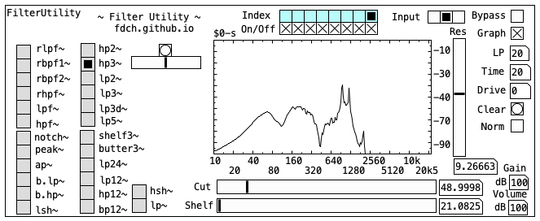

# Filter Utility

The FilterUtility is a small tool that efficiently loads community made Pd filters. I claim no authorship on these filters, and the respective ownership is made evident on every patch.
Head to the [Releases](https://github.com/fdch/FilterUtility/releases) to get the patch/plugin.

